# Spring-Boot-Microservices-Demo
This project demonstrates the application of spring boot to create microservices.

<h2>1. Overview</h2>
   We will create a customer service accessible at localhost:3001/customers and an order service on localhost:3002/orders

   Then we create a gateway service which will expose port 3005 and route "/customer" request to customer service and "/order" to order service.

   When we deploy microservices in production, we are more often than not, unaware of which particular hosts the order and customer service will be deployed to.
   This is where DiscoveryService comes in. DiscoveryService is defined as Eureka server. We define the customer, order and gateway services as eureka clients
   On eureka client start up, it looks for Eureka server and registers itself. Once registered, the other eureka clients queries the Eureka server to find out the actual host,port of other eureka clients and then directs the request to that particular client.

   We add Hystrix dashboard to monitor the state of our application in real time. We also add a Config server which reads the common properties from another location (github repo in this case) and then makes those properties available for other services. 
   Zipkin and sleuth are utilized to aid in distributed log tracing.

   Once the application is up and running in our local machine, we deploy it in Amazon EC2 instance using  beanstalk

<h2>2. Requirements </h2> 
   We use jdk 11 and gradle to build our application. 
   The project is structured as a gradle project with each microservice as a sub-project.
   For deploying into aws, aws client and eb client was installed in local machine.

https://docs.aws.amazon.com/cli/latest/userguide/cli-chap-install.html
https://docs.aws.amazon.com/elasticbeanstalk/latest/dg/eb-cli3-install.html

<h2>3. On Local host </h2>

<h3>a. CustomerService</h3>
   Exposed at port 3001
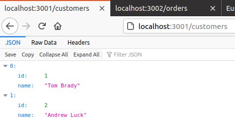
   
<h3>b. OrderService</h3>
Exposed at port 3002
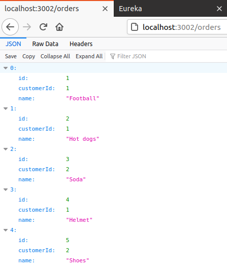

<h3>c. GatewayService</h3>
Exposed at port 3005 and directs

      - localhost:3005/customers to localhost:3001/customers
      - localhost:3005/orders to localhost:3002/orders

   Customer service routed via the gateway
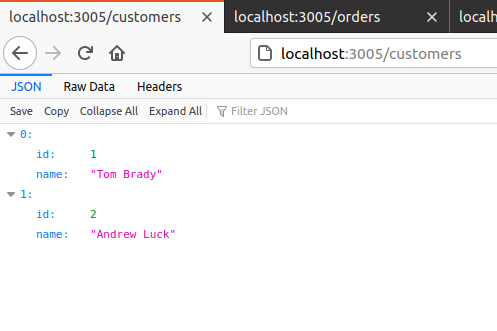

Order service routed via the gateway

   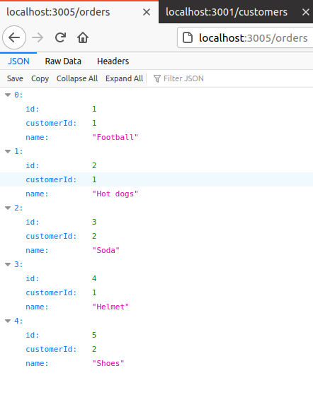
 

   We also display an error page to let users know that service is down
   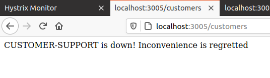

   
<h3>d. DiscoveryService</h3>

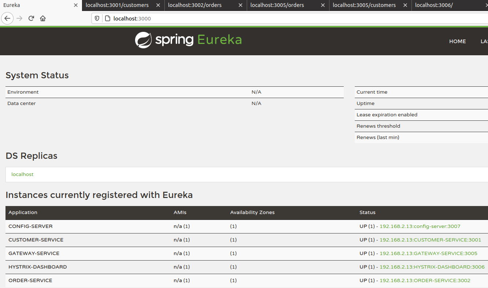

<h3>e. HystrixDashboard</h3>
   When services are up
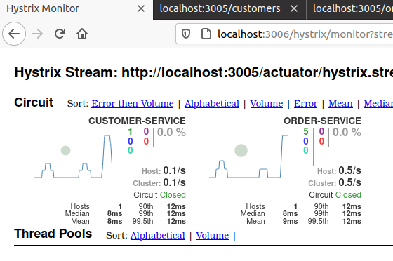
 

   When customer service goes down
   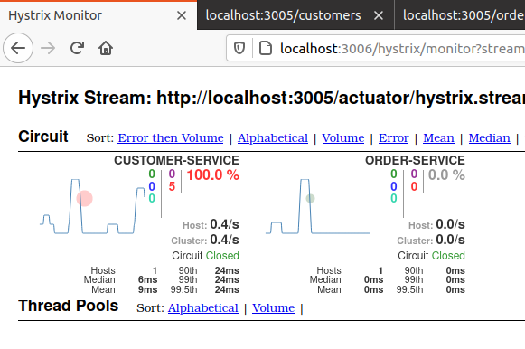
   
<h3>f. ConfigServer</h3>

   All the microservices require eureka server details at startup. So it makes sense to have the property defined globally(in some git repo ) and expose them via config server
   So for example when customer service is started, it queries the config server for the eureke server hosts, ports and then registers itself with discovery service.
   The properties are defined in https://github.com/koqonut/configurations

   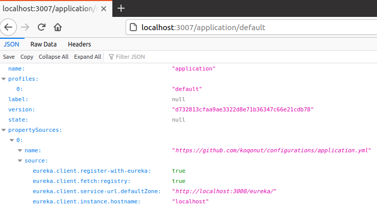

<h3>g. Zipkin and sleuth log tracing</h3>
   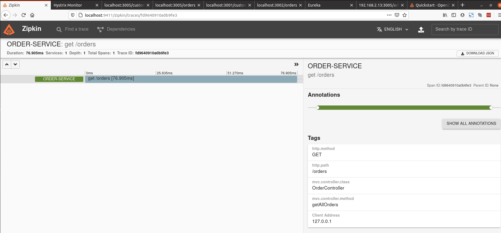
  

   sleuth log tracing
   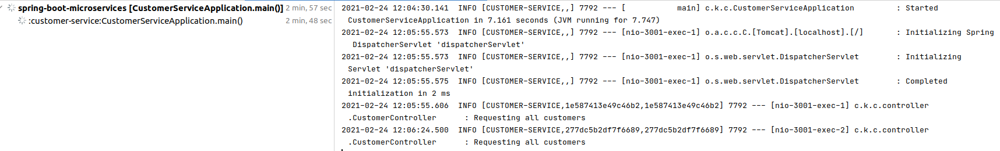

<h2>3. On AWS</h3>

   We use amazon bean stalk to deploy the application on Amazon EC2 instance
Inside the project root directory. 
  
   - eb init
   - eb create -s 

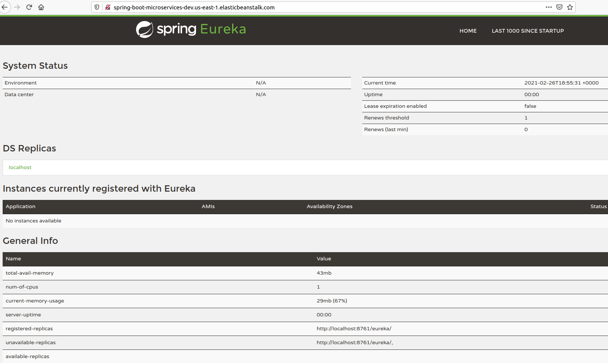

   - eb terminate spring-boot-microservices-dev
